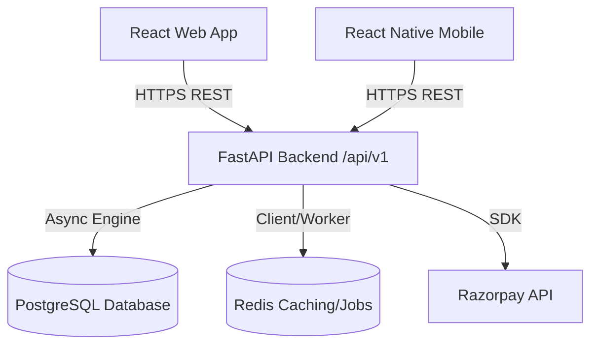

# GymCircle - System Architecture

This document describes the high-level system architecture, directories, component boundaries, security model, and tenant isolation mechanisms for GymCircle.

## Architecture Diagram

## Component Boundaries

### 1. Backend (FastAPI)
The backend is structured using Clean Architecture principles, separating routing, business logic, validation, and data access.
- **API Router Layer (`app/api/v1`)**: Handles HTTP requests, parsing, responses, and Swagger documentation.
- **Service Layer (`app/services`)**: Orchestrates business logic, permissions checks, and validation.
- **Data Access Layer (`app/models`)**: Defines SQLAlchemy declarative models.
- **Validation Layer (`app/schemas`)**: Declares Pydantic schemas for data serialization and deserialization.
- **Core (`app/core`)**: Security, configuration, JWT, middleware, and database connections.

### 2. Frontend Web (React + Vite + TypeScript)
- A single-page app (SPA) serving Gym Owners, staff, and Super Admins.
- Organized by features (e.g., `features/auth`, `features/memberships`, `features/attendance`).
- Integrates with Backend APIs using TanStack Query (`@tanstack/react-query`) for cache management and synchronization.

### 3. Mobile App (Expo + React Native)
- Multi-experience application catering to Clients (workout, diet, bookings), Trainers (schedules, client profiles), and Gym Owners (dashboards, attendance check-ins).
- Reuses typescript schemas and types where possible.
- Talks directly to the centralized REST API backend.

## Security & Authentication

GymCircle employs JWT (JSON Web Token) authentication:
1. **Access Tokens**: Short-lived (e.g., 30 minutes) bearer tokens used to authenticate requests.
2. **Refresh Tokens**: Longer-lived (e.g., 7 days) tokens used to request new access tokens.
3. **Role-Based Access Control (RBAC)**: Checked at the endpoint level via FastAPI dependencies (e.g., `deps.has_role("GYM_OWNER")`).

## Multi-Tenancy & Tenant Isolation

Tenant isolation is implemented at the backend query level to prevent cross-tenant data leaks.
- Each gym represents a **Tenant**.
- All tenant-specific tables contain a `gym_id` column.
- **Query Filtering**: The current tenant is derived from the authenticated user context (via JWT/Database lookup). The SQLAlchemy queries are filtered using this `gym_id`.
- **Database Context Helper**:
  During request lifecycle, a FastAPI dependency parses and validates the `gym_id` associated with the active user session and stores it. This ensures all database operations are scoped to that tenant automatically.
- **Super Admins**: Have a `NULL` tenant assignment, granting them global query access across all records.
