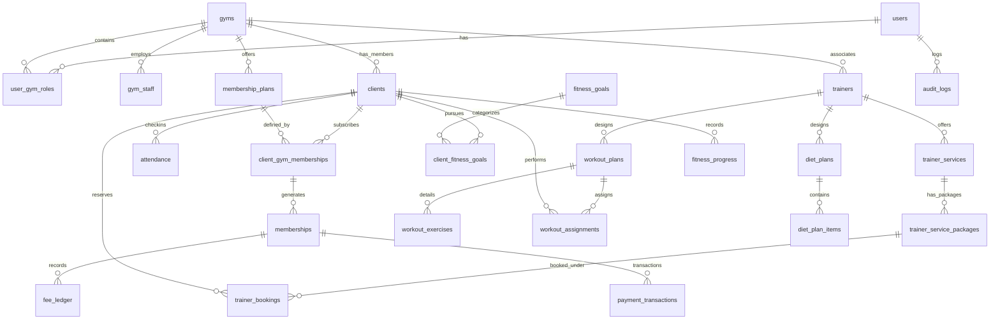

# GymCircle - Database Schema Design

This document details the database schema for GymCircle. We use a single PostgreSQL database with logical tenant isolation.

## Schema ERD (Mermaid)

## Core Tables (Implemented in Phase 0)

### 1. `users`
Represents platform-wide users (gym owners, staff, clients, trainers, and super admins).
- `id` (UUID, PK)
- `email` (VARCHAR, Unique, Nullable)
- `phone` (VARCHAR, Unique, Nullable)
- `hashed_password` (VARCHAR)
- `first_name` (VARCHAR)
- `last_name` (VARCHAR)
- `is_active` (BOOLEAN, Default True)
- `created_at` (TIMESTAMP)
- `updated_at` (TIMESTAMP)

### 2. `gyms`
Represents a gym tenant.
- `id` (UUID, PK)
- `name` (VARCHAR)
- `slug` (VARCHAR, Unique) - e.g. "gold-gym-east"
- `email` (VARCHAR, Nullable)
- `phone` (VARCHAR, Nullable)
- `address` (VARCHAR, Nullable)
- `city` (VARCHAR, Nullable)
- `state` (VARCHAR, Nullable)
- `pincode` (VARCHAR, Nullable)
- `latitude` (NUMERIC, Nullable)
- `longitude` (NUMERIC, Nullable)
- `opening_time` (TIME, Nullable)
- `closing_time` (TIME, Nullable)
- `facilities` (TEXT[], Nullable) - Array of text features
- `photos` (TEXT[], Nullable) - Array of photo URLs
- `status` (VARCHAR, Default 'ACTIVE') - ACTIVE, INACTIVE, SUSPENDED
- `created_at` (TIMESTAMP)
- `updated_at` (TIMESTAMP)

### 3. `user_gym_roles`
Binds users to gyms with specific RBAC roles.
- `id` (UUID, PK)
- `user_id` (UUID, FK to `users`)
- `gym_id` (UUID, FK to `gyms`, Nullable for SUPER_ADMIN or independent trainers)
- `role` (VARCHAR) - SUPER_ADMIN, GYM_OWNER, GYM_MANAGER, RECEPTIONIST, TRAINER, CLIENT
- `is_active` (BOOLEAN, Default True)
- `created_at` (TIMESTAMP)
- `updated_at` (TIMESTAMP)

## Planned Tables (Phases 1-6)

- `gym_staff`: Links users as staff members (managers/receptionists) with custom permission levels.
- `clients`: Complete client profile with DOB, gender, joining date, and emergency contacts.
- `trainers`: Trainer marketplace profile listing experience, certifications, and rating.
- `membership_plans`: Gym membership package structures (e.g., Monthly Plan, ₹1500).
- `client_gym_memberships`: Mapping from clients to active subscriptions.
- `memberships`: Concrete individual membership instances with start, end dates, and payment status.
- `fee_ledger`: Financial records tracking invoices, totals paid, and modes of payment.
- `payment_transactions`: Detailed payment gateway records (Razorpay Order IDs, signature verifications, etc.).
- `attendance`: Date, check-in, check-out timestamps for client tracking.
- `trainer_services` & `trainer_service_packages`: Service and booking specifications for trainers.
- `fitness_goals` & `client_fitness_goals`: List of target goal milestones.
- `workout_plans` & `workout_exercises` & `workout_assignments`: Custom workout charts and execution logs.
- `diet_plans` & `diet_plan_items`: Daily nutritional planner.
- `fitness_progress`: Time-series log tracking weight, height, BMI, measurements, and progress photos.
- `notifications` & `notification_templates` & `notification_logs`: Message dispatch tracking for SMS/WhatsApp/Email.
- `platform_fees`: Configuration and execution tracking of the flat ₹10 fee per platform transaction.
- `audit_logs`: Detailed immutable ledger tracking sensitive modifications (e.g., membership updates, role changes).
